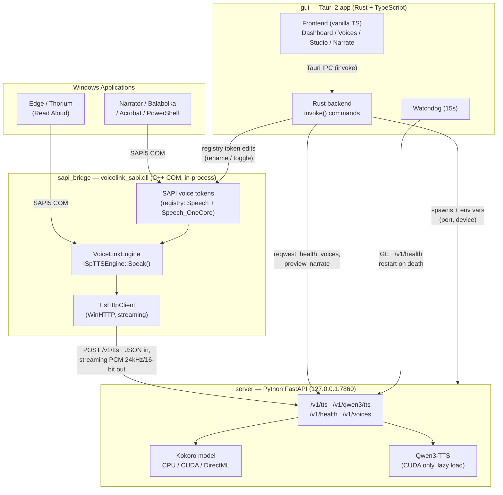
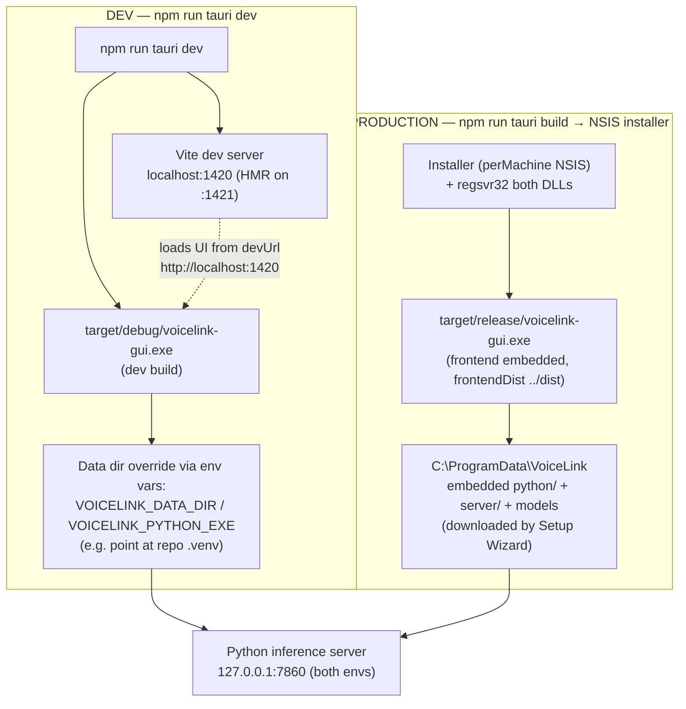
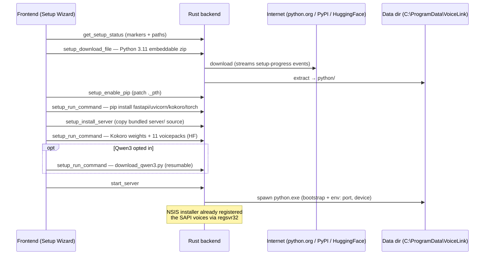
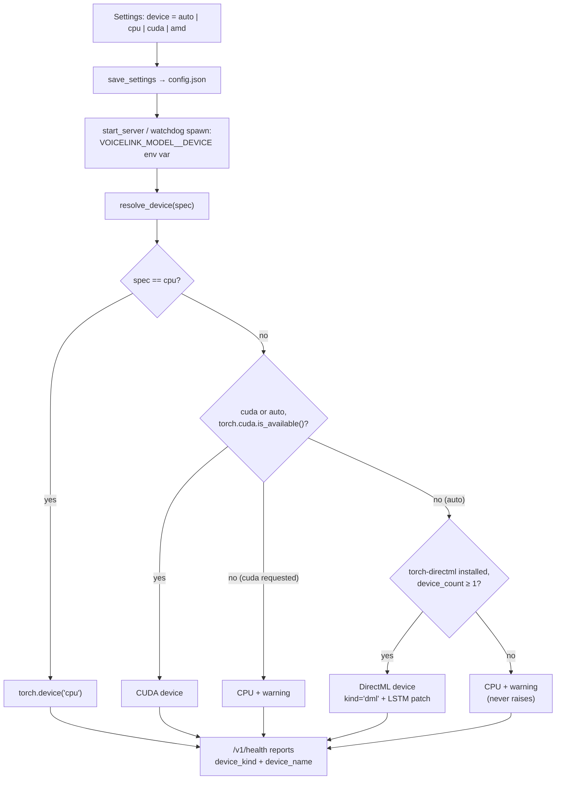

# VoiceLink Architecture

VoiceLink makes local AI voices (Kokoro, Qwen3-TTS) appear as normal Windows system voices. Any app that supports SAPI5 text-to-speech — Edge/Thorium Read Aloud, Narrator, Balabolka, Adobe Acrobat, PowerShell — can pick a VoiceLink voice from its dropdown and hear near-human speech, generated entirely on the local machine.

This document describes the components, the technologies behind them, and the workflows that connect them.

---

## 1. Big Picture



Everything lives on `127.0.0.1` — no cloud, no telemetry. The only external network traffic is first-run downloads (Python embeddable zip, pip packages, model weights from HuggingFace).

### Ports

| Port | What it is | Who uses it |
|---|---|---|
| **7860** | Python inference server (FastAPI/uvicorn) | COM DLL, Tauri GUI backend |
| **1420** | Vite dev server for the GUI frontend — **dev only** | `tauri dev`; never needed by end users |

The debug build of the GUI (`target/debug/voicelink-gui.exe`) loads its UI from `localhost:1420` and shows "connection refused" unless `npm run dev` is running. The release build bundles the frontend as static files (`frontendDist: ../dist`) and works standalone.

### Dev vs Production environments



| | Dev | Production |
|---|---|---|
| Frontend | Vite dev server at `localhost:1420`, hot-reload | Static files embedded in the exe |
| GUI binary | `target/debug/voicelink-gui.exe` | `target/release/voicelink-gui.exe` via NSIS installer |
| Python runtime | `VOICELINK_PYTHON_EXE` can point at a dev venv (e.g. repo `.venv312`) | Embedded Python in `C:\ProgramData\VoiceLink\python\`, downloaded at first run |
| Inference server | Same — `127.0.0.1:7860` | Same — `127.0.0.1:7860` |

The inference server side (port 7860, endpoints, models) is identical in both environments; only how the GUI gets its frontend and Python runtime differs.

---

## 2. Components

### 2.1 `gui/` — Tauri 2 desktop app

**Stack:** Rust (backend, `gui/src-tauri/src/lib.rs`, ~2,000 lines) + vanilla TypeScript/HTML/CSS (frontend, `gui/src/main.ts` + `index.html`, no React/router/framework) built with Vite 6 and TypeScript 5.

The frontend never talks HTTP to the server directly. It uses Tauri IPC exclusively — `invoke("command_name", {…})` for ~40 Rust commands, plus `listen()` for backend-pushed events (`setup-progress`, `server-watchdog-gave-up`). The Rust side uses `reqwest` to call the Python server and the `winreg` crate for registry work. Native file dialogs come from the `rfd` crate; only `tauri-plugin-opener` is loaded as a plugin.

**Pages** (single window, class-toggled sections): Dashboard (server + SAPI status, quick test), Voice Manager (rename / enable / disable SAPI voices), Settings (device selection `auto|cpu|cuda|amd`, port, autostart, Qwen3 opt-in), Voice Studio (voice cloning / design, Qwen3 only), Narrate (long-text narration with a custom WebAudio player and WAV export), and the first-run Setup Wizard.

**Key Rust responsibilities:**

- **First-run setup orchestration.** Downloads the Python 3.11 *embeddable* distribution into `<data_dir>\python\`, patches its `._pth` to enable pip and site-packages (embedded Python ignores `PYTHONPATH` while `._pth` exists — this is also how `python -m server.main` finds the server package), pip-installs the server's dependencies, copies the bundled `server/` directory into the data dir, and downloads Kokoro model + voicepacks from HuggingFace. Generic primitives (`setup_download_file`, `setup_extract_zip`, `setup_run_command`) are driven step-by-step by the TypeScript wizard.
- **Server lifecycle.** `start_server` spawns the embedded `python.exe` with a bootstrap snippet that monkey-patches `subprocess.Popen` to force `CREATE_NO_WINDOW` on all children (prevents CMD flashes from spaCy/HF downloads), then runs `server.main`. Env vars `VOICELINK_SERVER__PORT` and `VOICELINK_MODEL__DEVICE` are injected so the GUI's configured port/device actually take effect. A 15-second watchdog polls `/v1/health` and restarts the server (max 5 consecutive restarts) if it dies.
- **SAPI token management.** Reads/writes voice tokens under `HKLM\SOFTWARE\Microsoft\Speech\Voices\Tokens` and `...\Speech_OneCore\Voices\Tokens`, in both 64-bit and 32-bit (WOW6432Node) registry views — with a UAC-elevation fallback (temp PowerShell script + `Start-Process -Verb RunAs`) when HKLM isn't writable. Token values carry `CLSID`, `VoiceLinkVoiceId`, `VoiceLinkServerPort`, `VoiceLinkModel`, and `Attributes` (Name, Gender, Language, Age, Vendor).
- **App config** at `C:\ProgramData\VoiceLink\config.json` (serde_json): data dir, server port, device, autostart, Qwen3 flags. Tray icon with Show/Quit; `--minimized` flag for login autostart (HKCU `...\Run`).

### 2.2 `server/` — Python FastAPI inference server

**Stack:** Python 3.11, FastAPI + uvicorn, pydantic-settings (config from `VOICELINK_*` env vars), loguru, numpy/soundfile, torch. Runs inside the embedded Python installed by the GUI (dev override: `VOICELINK_PYTHON_EXE` / `VOICELINK_DATA_DIR`).

**API (the contract everything else depends on):**

| Endpoint | Purpose |
|---|---|
| `POST /v1/tts` | Kokoro synthesis — `{text, voice, speed, format:"pcm_24k_16bit"}` → streaming raw PCM |
| `GET /v1/voices` | Voice list (used by GUI; mirrors the DLL's registry table) |
| `GET /v1/health` | Status, model, GPU, `device_kind` (`cpu`/`cuda`/`dml`), `device_name` — polled by GUI watchdog |
| `POST /v1/qwen3/tts` | Qwen3 synthesis (streaming, language selection) |
| `POST /v1/qwen3/clone` | Voice cloning from an audio sample (multipart upload) |
| `POST /v1/qwen3/design` | Voice design (1.7B tier; not yet implemented) |
| `GET /v1/qwen3/speakers`, `/languages`, `/status` | Introspection |

**Audio format everywhere: raw PCM, 24 kHz, 16-bit signed LE, mono** — deliberately matched to SAPI's `SPSF_24kHz16BitMono` so no resampling ever happens. Responses advertise the format via `X-Audio-Sample-Rate/Width/Channels` headers; `X-Audio-Length` gives the exact total byte count, which the C++ DLL uses for proportional word-boundary event timing.

**Models (plugin-style registry, `TTSModel` ABC with `load/synthesize/unload`):**

- **Kokoro** (`models/kokoro_model.py`) — 11 built-in English voices. Multi-device:
  - `device_utils.resolve_device()` maps `auto|cpu|cuda|amd` → a torch device with a never-raise fallback policy: `auto` tries CUDA → DirectML → CPU.
  - **DirectML path (AMD GPUs on Windows)** — the current work-in-progress. CUDA is NVIDIA-only and ROCm doesn't ship for Windows, so `amd` uses Microsoft's `torch-directml`. Because DML exposes a "privateuseone" device object rather than a string, the loader builds `KModel()` explicitly and calls `.to(device)` instead of passing a device string to `KPipeline`. `torch-directml` is an optional dependency (commented out in `requirements.txt`; requires `torch<2.9`).
  - **DML LSTM patch** (`models/dml_compat.py`) — DirectML lacks the fused `aten::_thnn_fused_lstm_cell` kernel that `nn.LSTM` needs (Kokoro's duration predictor uses one bidirectional LSTM). The patch monkey-patches `nn.LSTM.forward` with a manual recurrence built only from DML-supported ops (matmul, sigmoid, tanh, chunk, flip) — mathematically identical to the fused kernel. It gates on `input.device.type == "privateuseone"`, so CPU/CUDA paths are untouched. *Note: `install_dml_lstm_patch()` is defined but not yet wired into `KokoroModel.load()` — pending work.*
  - There is also an ROCm-on-Windows code path (disables cuDNN/MIOpen when `torch.version.hip` is set).
- **Qwen3-TTS** (`models/qwen3_model.py`) — via `faster-qwen3-tts` with CUDA-graph capture (~6–10× speedup, ~100 s first-call warmup). 0.6B "standard" / 1.7B "full" tiers, 6 built-in speakers + voice cloning from a 3-second clip. **CUDA-only by design**; lazily loaded on first request and unloaded after 5 min idle to free VRAM. Long text is split on sentences with 10 ms crossfades and 400 ms paragraph gaps.

`server/download_qwen3.py` is a standalone CLI the GUI runs to pull Qwen3 weights from HuggingFace (resumable, machine-parseable `PROGRESS:`/`OK:` stdout protocol, writes a `.qwen3_ready` marker).

### 2.3 `sapi_bridge/` — C++ COM SAPI engine

**Stack:** C++17, CMake + Visual Studio 2022, WinHTTP. Static CRT (`/MT`), `/W4 /WX`, LTCG. Zero runtime dependencies — links only Windows system libraries. Built twice: `-A x64` → `voicelink_sapi.dll` and `-A Win32` → 32-bit copy (for 32-bit apps like Acrobat); each registers into its own registry view.

This is the component that makes the whole trick work: a classic in-process COM server implementing `ISpTTSEngine` + `ISpObjectWithToken` (CLSID `{D7A5E2B1-3F8C-4E69-A1B4-7C2D9E0F5A38}`), registered via `regsvr32` by the NSIS installer.

- **`DllRegisterServer`** writes the COM class plus 11 voice tokens (`VoiceLink_af_heart`, …) into **both** the classic `Speech` root (PowerShell, Balabolka, .NET) and `Speech_OneCore` root (Edge, Chromium, Narrator, UWP). Each token stores `VoiceLinkVoiceId`, `VoiceLinkServerPort=7860`, and SAPI `Attributes` (Gender, Language LCID, Age, Vendor).
- **`SetObjectToken`** — when a host app instantiates the voice, the engine reads its voice ID / model / port back from the registry token and points a WinHTTP client at `127.0.0.1:<port>`. (Host is hardcoded to localhost; only the port is configurable.)
- **`Speak`** — extracts text from the `SPVTEXTFRAG` list (handles SpellOut fragments), converts UTF-16→UTF-8, maps the app's rate slider to speed (the inverse of Chromium's mapping), hand-builds JSON (no JSON library), POSTs to `/v1/tts` or `/v1/qwen3/tts`, and streams the PCM body to the app in 8 KB chunks while firing proportional `SPEI_WORD_BOUNDARY`/`SPEI_SENTENCE_BOUNDARY` events — this is what makes Edge highlight words as they're read. Handles abort/skip mid-stream.
- **Failure philosophy:** if the Python server is down, the DLL retries 3× then returns silence with `S_OK` — the host app must never crash or show an error.

### 2.4 Installer & CI

- **NSIS installer** (Tauri bundling, `perMachine`): bundles both DLLs, the whole `server/` Python source, and the GUI. Installer hooks kill running processes, unregister old DLLs, run the previous uninstaller, then `regsvr32` both DLLs (System32 for 64-bit, SysWOW64 for 32-bit). Python and model weights are *not* bundled — downloaded at first run.
- **GitHub Actions** (`.github/workflows/ci.yml`, `release.yml`): Windows x64 only; builds both DLL flavors with CMake, then `npm run tauri build`; releases attach the NSIS `.exe`. No code signing.

### 2.5 Data layout

| Path | Contents |
|---|---|
| `C:\Program Files\VoiceLink` | GUI app, DLLs, bundled server source |
| `C:\ProgramData\VoiceLink` (`VOICELINK_DATA_DIR`) | `config.json`, `python/` (embedded runtime), `server/` (installed copy), model/voicepack caches, `voices/` (cloned voice profiles), `logs/`, readiness markers (`.voices_ready`, `.qwen3_ready`) |

---

## 3. Workflows

### 3.1 First run (Setup Wizard)



### 3.2 An app speaks (the hot path)

```mermaid
sequenceDiagram
    participant APP as Windows app (e.g. Edge)
    participant DLL as voicelink_sapi.dll (in-process COM)
    participant SRV as Python server (127.0.0.1:7860)

    APP->>DLL: SAPI picks VoiceLink_af_heart<br/>(token → CLSID → DLL)
    DLL->>DLL: SetObjectToken: read VoiceLinkVoiceId/Port<br/>from registry → init WinHTTP
    APP->>DLL: Speak(text)
    DLL->>DLL: collect SPVTEXTFRAGs → UTF-8 →<br/>JSON {"text","voice","speed","format"}
    DLL->>SRV: POST /v1/tts (or /v1/qwen3/tts)
    SRV->>SRV: asyncio.to_thread → Kokoro pipeline<br/>(CPU / CUDA / DirectML)
    SRV-->>DLL: streaming int16 PCM chunks<br/>+ X-Audio-Length header
    loop every 8 KB chunk
        DLL->>APP: ISpTTSEngineSite::Write() (volume-scaled PCM)
        DLL->>APP: AddEvents() SPEI_WORD_BOUNDARY /<br/>SPEI_SENTENCE_BOUNDARY (proportional)
    end
    Note over APP: User hears the voice;<br/>Edge highlights words in sync
```

Latency budget (from DEEP_DIVE.md): ~0.1 ms COM + ~2 ms HTTP + 100–800 ms first-chunk inference.

### 3.3 GUI management flows

```mermaid
flowchart LR
    subgraph FRONT["Frontend (TS)"]
        DASH[Dashboard]
        VM[Voice Manager]
        NARR[Narrate / Studio]
    end
    subgraph RUSTB["Rust backend"]
        POLL[Health poll (3s)]
        WD[Watchdog (15s,<br/>max 5 restarts)]
        REG[Registry edits<br/>rename / enable / disable]
        PROXY[HTTP proxy commands<br/>preview / narrate / clone]
    end
    subgraph SRVD["Python server"]
        H["GET /v1/health<br/>(device_kind, device_name)"]
        T["POST /v1/tts · /v1/qwen3/*"]
    end
    REGTOK["SAPI registry tokens<br/>(Speech + OneCore,<br/>64-bit + 32-bit views)"]

    DASH --> POLL --> H
    WD -- "restart on death<br/>(re-inject port + device env)" --> SRVD
    VM --> REG --> REGTOK
    NARR --> PROXY --> T
    DASH --> PROXY
```

- **Health polling / watchdog:** the Dashboard polls `/v1/health` and the watchdog restarts a dead server (≤5 times). Health exposes `device_kind`/`device_name` so the dashboard shows which accelerator is actually in use (cpu/cuda/dml).
- **Voice management:** enable/disable/rename are registry token edits in the Rust backend (dual registry roots × dual arch views, UAC fallback); the list merges `/v1/voices` + `/v1/qwen3/speakers` and overlays user renames from HKLM.
- **Preview:** GUI `preview_voice` → POST `/v1/tts` → raw PCM bytes → frontend Int16→Float32 → `AudioContext({sampleRate: 24000})`.
- **Narrate:** long text → `qwen3_narrate` (up to 600 s timeout) → WebAudio player + WAV export via native save dialog (Rust hand-writes the 44-byte WAV header).

### 3.4 Device selection (CPU / CUDA / AMD DirectML)



Qwen3 ignores this setting — it's CUDA-only and UI-gated on `nvidia-smi` detection.

---

## 4. Technology Summary

| Component | Language / Framework | Key tech |
|---|---|---|
| GUI backend | Rust | Tauri 2, tokio, reqwest, winreg, zip, rfd, tray-icon |
| GUI frontend | TypeScript (vanilla, no framework) | Vite 6, Tauri IPC (`invoke`/`listen`), WebAudio |
| Inference server | Python 3.11 | FastAPI, uvicorn, pydantic-settings, torch, kokoro, faster-qwen3-tts, loguru |
| SAPI bridge | C++17 | COM/OLE, ISpTTSEngine, WinHTTP, CMake/MSVC |
| Installer | NSIS (via Tauri bundler) | regsvr32 hooks, perMachine install |
| ML backends | PyTorch | CPU / CUDA (NVIDIA) / torch-directml (AMD, WIP) — ROCm-on-Windows path present |

## 5. Known Gaps / Work in Progress

- **AMD/DirectML (current branch `my-cumstom-branch`):** device selection and the DML loader path are in place; `dml_compat.install_dml_lstm_patch()` is written but not yet called from `KokoroModel.load()` — wiring that in is the next step. `torch-directml` remains an optional, manually installed dependency (`torch<2.9`).
- **Port configurability is partial:** `server_port` is configurable in Settings and is injected into the server process, but the GUI's health/voice/preview URLs, the pre-start TCP check, the watchdog poll, and the `VoiceLinkServerPort` registry value are hardcoded to 7860 — a non-default port will desync.
- Qwen3 voice *design* endpoint raises `NotImplementedError`; no single-instance guard for the GUI; no code signing; Windows-only.
